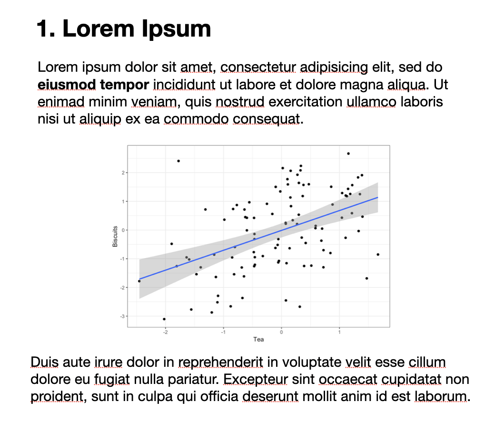

```{r packages, include=FALSE}
library(flipbookr)
library(here)
library(tidyverse)
library(kjhslides)
```


```{r setup, include=FALSE}

kjh_register_tenso()
kjh_set_knitr_opts()
kjh_set_slide_theme()
kjh_set_xaringan_opts()

```


class: center middle main-title section-title-1

# A Title Slide with .kjh-yellow[R]

.class-info[

**Data Wrangling: Session 1**

.light[Kieran Healy<br>
Statistical Horizons, April 2022
]

]

---

layout: true
class: title title-1

---

# A Bullet Point Slide

&nbsp;

--

.box-inv-1.medium[Blah]

--

.box-inv-1.medium[Blah]

--

.box-inv-1.medium.sp-after[Blah]

---

layout: false
class: center

# .huge.middle.squish4[<br />.kjh-orange[DATA ANALYSIS]<br />is mostly<br/>.kjh-red[DATA WRANGLING]]

---

layout: true
class: title title-1

---

# More Wisdom for the Ages

## Header 2

### Header 3

#### Header 4

---

# .kjh-green[Colors] and .kjh-pink[`monospace()`]


.pull-left[

## .kjh-green[Green]

## .kjh-blue[Blue]

## .kjh-lblue[Light Blue]

]

.pull-right[

## .kjh-pink[Pink]

## .kjh-orange[Orange]

## .kjh-yellow[Yellow]

]


---

layout: true
class: title title-1

---

```{r load_penguins, include = FALSE}

library(palmerpenguins)

```

`r chunk_reveal("penguin_tabs", widths = c(35,65), title = "# Breaks")`

```{r penguin_tabs, include = FALSE}
penguins %>% 
  filter(year != 2007) %>% 
  group_by(species) %>% 
  summarize(across(starts_with("bill"), 
                   list(mean = mean, 
                        sd = sd),
                   .names = "{.fn}_{.col}",
                   na.rm = TRUE)) 
```

---

```{r my_cars, include = FALSE}
as_tibble(cars) %>%
  filter(speed > 4) %>%
  ggplot() +
  aes(x = speed) +
  aes(y = dist) + #BREAK
  geom_point(
    alpha = .8, 
    color = "blue" 
    ) + #BREAK
  aes(size = speed) #BREAK
```

`r chunk_reveal("my_cars", break_type = "auto", title = "# Chunk Breaks")`

---

layout: false

## Figure

.center[
<figure>
  
</figure>
]

---

layout: true
class: title title-1

---

# Input and Output

.pull-left[
<figure>
  
</figure>
]

.pull-right[
<figure>
  
</figure>
]


---

# Pull left and right


.pull-left.center[
<figure>
  
</figure>
]

--

.pull-right[.box-inv-1.medium[Introduction]]

--

.pull-right[.box-inv-1.medium[Deep-dive]]

--

.pull-right[.box-inv-1.medium[Some more]]

---

# Pull left and right


.pull-left[
## Option 1

- Item L1

- Item L2

- Item L3
]

--

.pull-right[

## Option 2

- Item R1

- Item R2

- Item R3
]

---

# Scale Images small


---

# Scale images medium
.right[]


